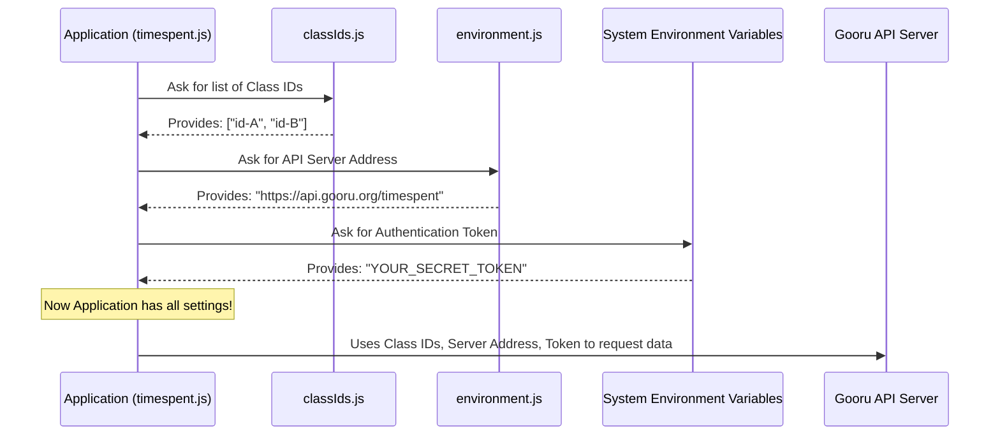

# Chapter 1: External Configuration Management

Imagine you have a fantastic app, but it needs some specific information to work – like the address of a server it needs to talk to, or a secret code to prove its identity. What if this information changes? Or what if you want to use your app in a "test" environment with one server, and then a "live" environment with another?

If you write these details directly inside your app's main code, it's like "hardcoding" them. Changing them would mean digging into the code and editing it every single time. That's not very flexible or secure!

This is where **External Configuration Management** comes in. Think of it as the "settings menu" for our `gooru-api-new` application. It allows us to keep important details *outside* the main program, making our app smarter, more flexible, and safer.

---

### What Problem Does It Solve?

Let's look at our `gooru-api-new` project. Its main job is to fetch data about "timespent" from an API (Application Programming Interface). To do this, it needs three crucial pieces of information:

1.  **The API server's address:** Where does it send its requests?
2.  **An authentication token:** A secret key that proves our app is allowed to access the data.
3.  **A list of "class IDs":** Which specific classes should the app fetch data for?

If we hardcoded these into our main `timespent.js` file:
*   Changing the server address would mean editing `timespent.js`.
*   Updating the authentication token would mean editing `timespent.js`.
*   Fetching data for a different set of classes would mean editing `timespent.js`.

This is inconvenient and risky, especially for sensitive info like the authentication token. External configuration solves this by letting us change these settings without ever touching the core logic of `timespent.js`.

---

### Key Concepts: Your App's "Settings"

Let's break down "External Configuration Management" into simple ideas:

*   **Configuration:** These are just the "settings" or "options" that your program needs to run.
*   **External:** This is the key part! It means these settings live *outside* your main program code. They could be in separate files, or in special "environment variables" on your computer.

#### Why is "External" Important?

| Benefit       | Explanation                                                                                                                                                                                            |
| :------------ | :----------------------------------------------------------------------------------------------------------------------------------------------------------------------------------------------------- |
| **Flexibility** | You can easily switch between different environments (e.g., "testing" vs. "live") by just changing a setting file, not the code.                                                                         |
| **Security**    | Sensitive information (like secret tokens) is kept out of the main code, especially if that code is shared or stored in public places like GitHub.                                                   |
| **Reusability** | The same application code can be used for many different purposes or customers, simply by giving it different configurations.                                                                          |
| **Collaboration** | Different team members can use their own local settings without interfering with each other's work or accidentally committing their personal settings.                                               |

---

### How Our `gooru-api-new` App Uses External Configuration

Our main script, `timespent.js`, needs to get its settings from somewhere. Let's see how it "asks" for them:

```javascript
// File: timespent.js

// 1. Getting the list of class IDs
const { classIds } = require('./classIds');

// 2. Getting the API server address
const { apiRequest } = require('./environment');

// ... (other code) ...

// 3. Getting the authentication token
const authToken = process.env.AUTH_TOKEN;

// ... (rest of the code that uses these values) ...
```

In this small snippet from `timespent.js`:

*   `require('./classIds')` tells the app to look into a file named `classIds.js` to find the list of class IDs.
*   `require('./environment')` tells the app to look into a file named `environment.js` to find the API server address.
*   `process.env.AUTH_TOKEN` tells the app to look for a special "environment variable" on your computer named `AUTH_TOKEN` to find the secret token.

This means if we want to change any of these, we just edit `classIds.js`, `environment.js`, or set the `AUTH_TOKEN` environment variable, *without* touching `timespent.js` itself!

---

### What Happens "Under the Hood"? (Internal Implementation)

Let's trace the steps when our application starts and uses its external settings:



As you can see, the `timespent.js` application doesn't *contain* the settings itself. It simply knows *where* to go to get them. This separation is powerful!

Now, let's look at the simple files that hold these settings:

#### 1. The `classIds.js` File

This file simply holds a list of class IDs that the application needs to process.

```javascript
// File: classIds.js
const classIds = [
    "class-ID-example-1",
    "class-ID-example-2",
    "class-ID-example-3"
];

module.exports = { classIds };
```

**Explanation:** This is a straightforward JavaScript file. It creates an array (a list) called `classIds` and fills it with dummy IDs. The `module.exports = { classIds };` line makes this list available for other files (like `timespent.js`) to `require` and use. If you need to fetch data for different classes, you just open `classIds.js` and change the list!

#### 2. The `environment.js` File

This file holds the base address of the API server.

```javascript
// File: environment.js
const apiRequest = "https://api.gooru.org/api/timespent";

module.exports = { apiRequest };
```

**Explanation:** Similar to `classIds.js`, this file stores a single piece of information: the URL (web address) for the API endpoint related to timespent data. If the API server's address ever changes, or you want to point your app to a test server, you only need to modify this one file.

#### 3. Environment Variables (for sensitive data like `AUTH_TOKEN`)

For very sensitive information like authentication tokens, we often use something called "environment variables." These are special variables that your operating system (like Windows, macOS, or Linux) knows about. When your program runs, it can ask the operating system for the value of these variables.

Our `timespent.js` file uses:
```javascript
// File: timespent.js
// ...
const authToken = process.env.AUTH_TOKEN;
// ...
```

**Explanation:** `process.env` is a special object in Node.js (the technology our app runs on) that lets us access these environment variables. `AUTH_TOKEN` is just the *name* of the variable we expect to find.

**Why use environment variables for tokens?**
Imagine you accidentally share your code online. If your secret token was hardcoded, everyone would see it! Environment variables are generally kept out of your code files and are often set up on the computer running the app, making them much more secure.

#### The `.gitignore` File

You might notice something interesting in our project's `.gitignore` file:

```
# File: .gitignore
.env
node_modules/
.DS_Store
classIds.js
environment.js
```

**Explanation:** The `.gitignore` file tells version control systems (like Git, which manages our project's changes) which files to *ignore* and not track. Notice that `classIds.js` and `environment.js` are listed here. This often means:

*   These files contain settings specific to *your* local machine or environment.
*   You might create these files based on a template, but they are not committed to the main project's history.
*   This ensures that sensitive URLs or specific test class IDs you're using don't accidentally get shared with everyone or cause conflicts when others work on the project. Everyone sets up their *own* local `classIds.js` and `environment.js` files according to their needs.

---

### Conclusion

In this chapter, we learned that "External Configuration Management" is like giving our application a flexible "settings menu." Instead of hardcoding crucial details like API server addresses, authentication tokens, or lists of class IDs directly into the main code, we store them in separate, easily changeable locations (like `classIds.js`, `environment.js`, and environment variables). This approach makes our `gooru-api-new` application:

*   **Flexible:** Easily adapts to different servers or data sets.
*   **Secure:** Keeps sensitive information out of the main codebase.
*   **Maintainable:** Changes to settings don't require changes to the core logic.

Now that we understand how our application gets its instructions, in the next chapter, we'll dive into what it *does* with them! We'll explore how it handles processing data for all those class IDs.

[Next Chapter: Iterative Data Processing](02_iterative_data_processing_.md)

---

<sub><sup>Generated by [AI Codebase Knowledge Builder](https://github.com/The-Pocket/Tutorial-Codebase-Knowledge).</sup></sub> <sub><sup>**References**: [[1]](https://github.com/sunder122/gooru-api-new/blob/3e46afc21eae004f7654f11f0360f589b14ad86d/.gitignore), [[2]](https://github.com/sunder122/gooru-api-new/blob/3e46afc21eae004f7654f11f0360f589b14ad86d/timespent.js)</sup></sub>
