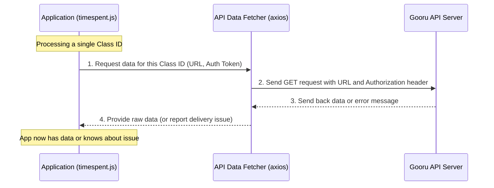

# Chapter 3: API Data Fetcher

Welcome back! In [Chapter 1: External Configuration Management](01_external_configuration_management_.md), we learned how our `gooru-api-new` application gets its vital settings, like the list of class IDs, the API server's address, and its secret authentication token, from external files. Then, in [Chapter 2: Iterative Data Processing](02_iterative_data_processing_.md), we saw how our app systematically goes through each `classId` in that list, one by one, like an assembly line.

Now, for each `classId` on that assembly line, our application needs to actually *get* the data from the Gooru API server. How does it do that? It uses a crucial component we call the **API Data Fetcher**.

---

### What Problem Does It Solve?

Imagine you're sending a letter to a friend. You need their correct address, maybe a special password to get past their doorman, and then you send the letter. After a while, you expect a reply. If the letter gets lost, or your friend's address was wrong, you'd want to know!

Our `gooru-api-new` project faces a similar task. For every `classId` it needs to process, it has to:
1.  **Know where to send the request:** The correct web address (URL) for the Gooru API.
2.  **Prove its identity:** Send an "authentication token" so the API knows our app is allowed to ask for data.
3.  **Send the request and wait:** Actually send the message and wait patiently for a reply.
4.  **Receive and understand the reply:** Get the data back from the server.
5.  **Handle problems:** What if the server is busy, or says "you're not allowed!"?

The **API Data Fetcher** is the part of our application that handles all these steps. It's like our dedicated, diligent messenger responsible for requesting information from the remote Gooru API server. It takes care of all the complex network communication so the rest of our app can focus on *what to do* with the data, not *how to get it*.

---

### Key Concepts: Your App's Diligent Messenger

Let's break down the role of the "API Data Fetcher" into simple ideas:

*   **Constructing the Address (URL):** Just like a physical address, every piece of information on the internet has a unique web address (URL). The Data Fetcher knows how to build the *exact* URL needed to ask for "timespent" data for a specific `classId`.
*   **Including Credentials (Authentication Token):** Servers often need to know *who* is asking for data. This is for security. Our Data Fetcher includes a special "authentication token" (which we get from [External Configuration Management](01_external_configuration_management_.md)) in its request, proving that our app is authorized.
*   **Sending and Waiting (Making the Request):** The Data Fetcher uses a powerful tool (like a special post office) to actually send the request over the internet and then patiently waits for the server to reply.
*   **Receiving and Checking the Reply:** Once the server replies, the Data Fetcher receives the information. It also checks if the reply is successful (e.g., "OK, here's your data!") or if there was a problem (e.g., "Access Denied!" or "Something went wrong!").
*   **Preparing Data or Reporting Issues:** If the data arrives safely, the Fetcher makes sure it's in a format our app can easily use. If there's a problem, it reports the issue so our app knows what happened.

---

### How Our `gooru-api-new` App Uses the API Data Fetcher

Our `timespent.js` script, within its iterative loop for each `classId`, uses a popular JavaScript tool called `axios` to act as its "API Data Fetcher." `axios` is like a reliable assistant that handles all the technical details of sending and receiving web requests.

Here's how our app tells the Data Fetcher (powered by `axios`) to get data for a single `classId`:

```javascript
// File: timespent.js (inside the loop for each classId)

// ... (previous setup for classId, apiRequest, authToken) ...

// 1. Constructing the Address (URL)
const url = `${apiRequest}?classId=${classId}&to=${params.to}&from=${params.from}`;

try {
    // 2. Sending the Request with Credentials
    const response = await axios.get(url, {
        headers: { 'Content-Type': 'application/json', 'Authorization': `${authToken}` }
    });

    // 3. Receiving the Reply
    const data = response.data; // This is the actual timespent data!
    // ... (rest of the code to process data) ...

} catch (error) {
    // 4. Handling Problems
    console.log(`Request Failed for classId ${classId}:`, error.message);
    // ... (rest of error handling) ...
}
```

**Explanation:**

*   **`const url = ...`**: This line builds the complete web address. It combines the base API server address (`apiRequest` from [Chapter 1](01_external_configuration_management_.md)), the specific `classId` we're currently processing, and the date range (`to` and `from`). This is the "address" for our messenger.
*   **`await axios.get(url, { ... })`**: This is the core of the Data Fetcher!
    *   `axios.get`: This tells `axios` to send a "GET" request, which is a common way to *ask* for information from a server.
    *   `url`: This is the address where `axios` should send the request.
    *   `{ headers: { ... } }`: These are like special notes attached to our request.
        *   `'Content-Type': 'application/json'`: Tells the server we expect to send and receive data in JSON format (a common way to organize data for web services).
        *   `'Authorization': `${authToken}``: This is where our secret authentication token (from [Chapter 1](01_external_configuration_management_.md)) is included. It's like our app's ID badge, proving it has permission.
    *   `await`: This is important! It means our program will "wait" right here until `axios` gets a reply from the server before moving on.
*   **`const response = ...`**: Once `axios` gets a reply, it puts all the details into a `response` object.
*   **`const data = response.data;`**: The actual information we asked for (the timespent data for this `classId`) is usually found inside `response.data`.
*   **`try { ... } catch (error) { ... }`**: As discussed in [Chapter 2](02_iterative_data_processing_.md), this `try...catch` block is crucial. If `axios` encounters any problem (like a network issue, or the server sends an error message), the code in the `catch` block runs, allowing our app to log the problem and continue processing other `classId`s without crashing.

---

### What Happens "Under the Hood"? (Internal Implementation)

Let's trace the steps when our `timespent.js` application needs to fetch data for one `classId` using its API Data Fetcher:



Here's how the `timespent.js` file uses `axios` to implement the API Data Fetcher:

The relevant part of `timespent.js` looks like this:

```javascript
// File: timespent.js (Snippet focused on API call)

// ... (definitions of axios, classId, apiRequest, authToken, params) ...

for (let i = 0; i < classIds.length; i++) {
    const classId = classIds[i]; // Get current class ID
    const url = `${apiRequest}?classId=${classId}&to=${params.to}&from=${params.from}`;

    try {
        const response = await axios.get(url, {
            headers: {
                'Content-Type': 'application/json',
                'Authorization': `${authToken}`
            }
        });

        // If request is successful:
        const data = response.data;
        // The 'data' variable now holds the timespent information
        // for this specific classId, ready for the Excel Report Generator!

    } catch (error) {
        // If request fails (e.g., network error, server error):
        console.log(`Request Failed for classId ${classId}:`, {
            error: error.message,
            statusCode: error.response ? error.response.status : 'N/A'
        });
        // The error information is logged, and the loop continues to the next classId.
    }
}
```

**Step-by-step breakdown:**

1.  **URL Construction:** For each `classId`, the line `const url = ...` dynamically creates the specific API endpoint URL. This is like writing the exact address on an envelope.
2.  **Request Execution (`axios.get`):** The `axios.get` function is called with this `url` and a `headers` object.
    *   `axios` then internally opens a network connection to the `Gooru API Server`.
    *   It sends the HTTP GET request, including all the headers (especially the `Authorization` token). This is like `axios` acting as the courier, delivering your addressed and authorized envelope.
3.  **Waiting for Response (`await`):** The `await` keyword ensures that the program pauses here. It doesn't move to the next line until `axios` either gets a successful response or an error.
4.  **Processing Response (`response.data`):**
    *   If the `Gooru API Server` replies successfully, `axios` receives the data. It then wraps this data along with other details (like the status code, e.g., "200 OK") into the `response` object.
    *   The `response.data` property then contains the actual timespent information in a usable format (usually JSON). This is like the courier bringing back the reply letter, and you opening it to read the message.
5.  **Error Handling (`catch`):** If the `Gooru API Server` sends an error (e.g., "401 Unauthorized", "404 Not Found") or if there's a network issue preventing the request from even reaching the server, `axios` "throws" an error. The `catch (error)` block then intercepts this error, allowing our application to log the problem gracefully and continue processing other class IDs without crashing.

This diligent "API Data Fetcher" ensures that our application can reliably communicate with the Gooru API, get the necessary information, and gracefully handle any issues that might arise during this communication.

---

### Conclusion

In this chapter, we unpacked the concept of the "API Data Fetcher," the crucial component that handles all communication with the Gooru API. We learned that it's like a reliable messenger responsible for:

*   Building the correct web address (URL).
*   Including necessary credentials (authentication token).
*   Sending the request and patiently waiting for a reply.
*   Receiving and preparing the data, or reporting any delivery issues.

This abstraction allows our `gooru-api-new` application to effectively get the data it needs for each `classId` in its iterative process. Now that our application knows how to fetch the data, the next logical step is to figure out what to *do* with that data. In the next chapter, we'll dive into how our application generates a useful Excel report from the fetched information.

[Next Chapter: Excel Report Generator](04_excel_report_generator_.md)

---

<sub><sup>Generated by [AI Codebase Knowledge Builder](https://github.com/The-Pocket/Tutorial-Codebase-Knowledge).</sup></sub> <sub><sup>**References**: [[1]](https://github.com/sunder122/gooru-api-new/blob/3e46afc21eae004f7654f11f0360f589b14ad86d/timespent.js)</sup></sub>
