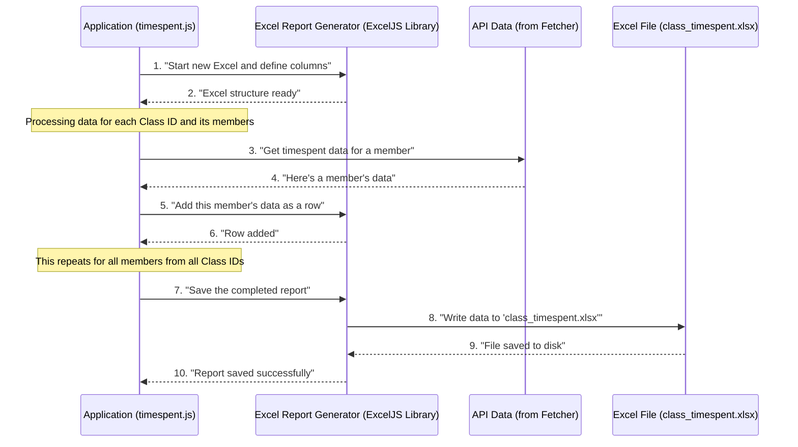

# Chapter 4: Excel Report Generator

Welcome back! In [Chapter 1: External Configuration Management](01_external_configuration_management_.md), we learned how our `gooru-api-new` application gets its vital settings from external files. Then, in [Chapter 2: Iterative Data Processing](02_iterative_data_processing_.md), we saw how our app systematically processes each class ID one by one. And most recently, in [Chapter 3: API Data Fetcher](03_api_data_fetcher.md), we explored how our application actually talks to the Gooru API to fetch the timespent data for each class.

Now that our application knows *what* to get (from class IDs), *how* to process them (iteratively), and *how* to fetch the data (using the API Data Fetcher), the crucial final step is: what do we *do* with all this raw information? Simply getting data isn't useful unless it's presented in an understandable way. This is where the **Excel Report Generator** comes in!

---

### What Problem Does It Solve?

Imagine you've gathered a lot of important notes and numbers, but they're just scattered pieces of paper. It's hard to read, share, or make sense of them. What you need is an organized way to present them.

Our `gooru-api-new` project collects "timespent" data for many members across different classes. This data, when it comes back from the API, is raw and unorganized. If we just showed you the raw data, it would look like a jumble of technical text:

```json
{
  "class_id": "example-class-123",
  "members": [
    {
      "id": "member-A",
      "first_name": "Alice",
      "last_name": "Smith",
      "total_assessment_timespent": 1200
    },
    {
      "id": "member-B",
      "first_name": "Bob",
      "last_name": "Johnson",
      "total_assessment_timespent": 1800
    }
  ]
}
```
This is hard for a human to read quickly!

The **Excel Report Generator** solves this problem. Think of it as an organized secretary. Its job is to take these raw pieces of information, such as timespent data for class members, and neatly arrange them into a professional Excel spreadsheet. It defines the columns, fills in the data for each row, and ensures the final document is properly saved to a file, making the data easily viewable and shareable with anyone, even those without technical skills.

---

### Key Concepts: Your Data's Organized Secretary

Let's break down how the "Excel Report Generator" works:

*   **The Workbook (The Big Binder):** This is the entire Excel file itself. Just like a physical binder can hold many sheets of paper.
*   **The Worksheet (A Page in the Binder):** Inside the workbook, there are individual sheets. We use one of these to hold our timespent data.
*   **Columns (The Labels on Top):** Before putting in data, you need to define what kind of information each column will hold. For example, "Class ID", "Member ID", "Total Timespent". These are the headers at the very top of your Excel sheet.
*   **Rows (Filling in the Blanks):** For each piece of data (e.g., one class member's timespent details), we create a new row and fill in the values for each column.
*   **Saving (Putting it in the Filing Cabinet):** Once all the data is organized, the final step is to save the entire workbook as an Excel file (`.xlsx`) to your computer.

---

### How Our `gooru-api-new` App Uses the Excel Report Generator

Our `timespent.js` script uses a special tool (a JavaScript library) called `exceljs` to handle all the Excel generation. `exceljs` is like our organized secretary who knows all the tricks to create neat spreadsheets.

Here's how our app tells the "Excel Report Generator" (powered by `exceljs`) to create our report:

```javascript
// File: timespent.js (Snippet)

const ExcelJS = require('exceljs'); // 1. Bring in the Excel tool

async function fetchClassTimespent() {
    // 2. Create a new Excel Workbook (the "binder")
    const workbook = new ExcelJS.Workbook();
    // 3. Add a new Worksheet (a "page" in the binder)
    const worksheet = workbook.addWorksheet('Class Timespent');

    // 4. Define the Columns (the "labels" for our data)
    worksheet.columns = [
        { header: 'Class ID', key: 'classId', width: 40 },
        { header: 'Member ID', key: 'memberId', width: 40 },
        { header: 'Total Assessment Timespent', key: 'totalAssessmentTimespent', width: 25 }
        // ... more columns ...
    ];

    // ... (Loop where we fetch data for each class ID) ...
    // Inside the loop, after fetching data for a member:
    if (data.members && Array.isArray(data.members)) {
        data.members.forEach(member => {
            // 5. Add a Row for each member
            worksheet.addRow({
                classId: classId,
                memberId: member.id,
                totalAssessmentTimespent: member.total_assessment_timespent
                // ... fill other columns ...
            });
        });
    }

    // 6. After all data is processed, save the Workbook to a file
    await workbook.xlsx.writeFile('class_timespent.xlsx');
    console.log('Excel file saved as class_timespent.xlsx');
}
```

**Explanation:**

1.  **`const ExcelJS = require('exceljs');`**: This line brings the `exceljs` library into our script, giving us all the tools we need to work with Excel.
2.  **`const workbook = new ExcelJS.Workbook();`**: This creates an empty Excel file in our computer's memory. It's like opening a brand new, empty binder.
3.  **`const worksheet = workbook.addWorksheet('Class Timespent');`**: We add a new "sheet" (a tab at the bottom of Excel) to our workbook and give it the name "Class Timespent".
4.  **`worksheet.columns = [...]`**: This is where we tell ExcelJS what our columns should be called and how wide they should be. `header` is the visible name, and `key` is how we'll refer to it in our code when adding data.
5.  **`worksheet.addRow({...})`**: This is done repeatedly inside the main loop of our application (the [Iterative Data Processing](02_iterative_data_processing_.md) from Chapter 2). For every `member` whose timespent data we get (via the [API Data Fetcher](03_api_data_fetcher.md) from Chapter 3), we create a new row in our Excel sheet and fill in the data for each column using the `key` names we defined.
6.  **`await workbook.xlsx.writeFile('class_timespent.xlsx');`**: After all class IDs and their members have been processed and their data added to the worksheet, this final line takes our complete "workbook" from memory and saves it as an actual file named `class_timespent.xlsx` on your computer.

---

### What Happens "Under the Hood"? (Internal Implementation)

Let's trace the steps when our `timespent.js` application generates the Excel report:



Here's how the relevant part of `timespent.js` implements this:

```javascript
// File: timespent.js (Snippet focused on Excel generation)

const ExcelJS = require('exceljs'); // Make ExcelJS available

async function fetchClassTimespent() {
    const workbook = new ExcelJS.Workbook(); // Create a new empty Excel file
    const worksheet = workbook.addWorksheet('Class Timespent'); // Add a sheet to it

    // Define the structure of your table in Excel
    worksheet.columns = [
        { header: 'Class ID', key: 'classId', width: 40 },
        { header: 'Member ID', key: 'memberId', width: 40 },
        { header: 'First Name', key: 'firstName', width: 20 },
        { header: 'Last Name', key: 'lastName', width: 20 },
        { header: 'Total Assessment Timespent', key: 'totalAssessmentTimespent', width: 25 },
        { header: 'Timestamp', key: 'timestamp', width: 30 }
    ];

    // ... (This code runs inside the loop, for each classId and then for each member) ...
    // Assume 'classId' and 'data' (from API response) are available here
    if (data.members && Array.isArray(data.members)) {
        data.members.forEach(member => {
            // For each member, create a new row in the Excel sheet
            worksheet.addRow({
                classId: classId,
                memberId: member.id || 'N/A', // Use 'N/A' if data is missing
                firstName: member.first_name || 'N/A',
                lastName: member.last_name || 'N/A',
                totalAssessmentTimespent: member.total_assessment_timespent || 0,
                timestamp: getTimestamp() // A function to get current time
            });
        });
    } else {
        // If a class ID has no members or bad data, add a default row
        worksheet.addRow({
            classId: classId,
            memberId: 'N/A',
            firstName: 'N/A',
            lastName: 'N/A',
            totalAssessmentTimespent: 0,
            timestamp: getTimestamp()
        });
    }
    // ... (End of the loop for class IDs) ...

    // After the loop finishes (all class IDs processed):
    // Save the entire Excel file to your computer
    await workbook.xlsx.writeFile('class_timespent.xlsx');
    console.log('Excel file saved as class_timespent.xlsx');
}
```

**Step-by-step breakdown:**

1.  **Workbook and Worksheet Initialization:** At the very beginning of the `fetchClassTimespent` function, an empty `workbook` object is created, and then a `worksheet` (named 'Class Timespent') is added to it. This sets up the empty Excel container.
2.  **Column Definition:** The `worksheet.columns` array is set up. Each object in this array defines one column. `header` is what you see in the Excel sheet, and `key` is how the program will refer to that column when adding data. `width` simply makes the column wider for readability.
3.  **Row Population (Iterative):**
    *   As our application loops through each `classId` (from [Chapter 2](02_iterative_data_processing_.md)), and after it successfully fetches data for that class ID using the [API Data Fetcher](03_api_data_fetcher.md), it checks if there are `members` in the `data` returned by the API.
    *   If `members` exist, it then uses `forEach` to go through *each* `member` in that list.
    *   For every `member`, `worksheet.addRow({...})` is called. This function takes an object where the `keys` match the `key` names defined in `worksheet.columns` (e.g., `classId`, `memberId`). The `values` are the actual data for that specific member. This is how the data is neatly placed into the correct cells under the correct columns.
    *   If a class has no members, a default row with 'N/A' and 0 values is added to ensure that the class ID is at least recorded in the report.
4.  **File Saving:** Once the main loop finishes and data for *all* class IDs has been processed and added to the `worksheet`, the line `await workbook.xlsx.writeFile('class_timespent.xlsx');` is executed. This command takes all the data currently held in the `workbook` object in memory and writes it out as a complete `.xlsx` file on your computer.

This systematic process ensures that all the fetched data is transformed from raw, technical information into a user-friendly, shareable Excel report.

---

### Conclusion

In this chapter, we learned about the "Excel Report Generator," the crucial component that takes all the raw data our application fetches and transforms it into a clean, organized, and shareable Excel spreadsheet. We explored:

*   How it acts like an organized secretary to structure raw data.
*   Key concepts like Workbooks, Worksheets, Columns, and Rows.
*   How our `gooru-api-new` application uses the `exceljs` library to define columns, add rows of data, and save the final report.

Now that our application can fetch data, process it iteratively, and generate a beautiful Excel report, the final piece of the puzzle is understanding how we monitor its operations and get summaries of its work. In the next chapter, we'll dive into how our application provides **Operational Monitoring & Reporting**.

[Next Chapter: Operational Monitoring & Reporting](05_operational_monitoring___reporting_.md)

---

<sub><sup>Generated by [AI Codebase Knowledge Builder](https://github.com/The-Pocket/Tutorial-Codebase-Knowledge).</sup></sub> <sub><sup>**References**: [[1]](https://github.com/sunder122/gooru-api-new/blob/3e46afc21eae004f7654f11f0360f589b14ad86d/timespent.js)</sup></sub>
