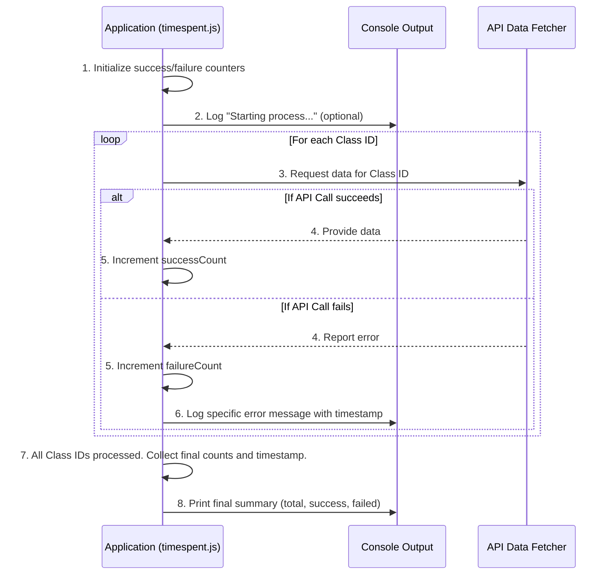

# Chapter 5: Operational Monitoring & Reporting

Welcome back for our final chapter! In [Chapter 1: External Configuration Management](01_external_configuration_management_.md), we learned how our `gooru-api-new` application gets its vital settings. In [Chapter 2: Iterative Data Processing](02_iterative_data_processing_.md), we saw how it processes each `classId` one by one. In [Chapter 3: API Data Fetcher](03_api_data_fetcher.md), we explored how it talks to the Gooru API to get data. And in [Chapter 4: Excel Report Generator](04_excel_report_generator_.md), we discovered how it turns all that raw data into a neat Excel report.

Now, imagine you've set up this amazing system to fetch data and create reports. You start it running, and it quietly works away. But how do you know if it *actually* worked perfectly? Did every single API request succeed? Were there any errors? How many? When did the whole process finish?

This is where **Operational Monitoring & Reporting** comes in. It's like a watchful project manager who keeps score, making sure you always know exactly how your application performed.

---

### What Problem Does It Solve?

Think of our `gooru-api-new` application as a busy assistant who goes out and fetches many items (data for class IDs) and organizes them (into an Excel report). You tell the assistant, "Go fetch data for these 100 classes!"

When the assistant is done, you don't just want the Excel report. You also want a quick update on *how the job went*:
*   "Did you get data for all 100 classes?"
*   "Were there any classes you couldn't get data for?"
*   "If so, how many, and what was the problem?"
*   "Exactly when did you start and finish this task?"

Without **Operational Monitoring & Reporting**, our application would just produce the Excel file and then silently stop. We wouldn't know if it successfully processed all class IDs, or if some failed due to network issues or API errors. We'd have to manually check the Excel file or dig through long log files to understand its performance.

This component solves that by providing a clear, concise summary of the script's execution status and performance, like a "report card" for the application itself.

---

### Key Concepts: Your App's Scorecard

Let's break down "Operational Monitoring & Reporting" into simple ideas:

*   **Tracking Successes:** Every time our app successfully fetches data for a `classId` and processes it, we mark it as a "success."
*   **Tracking Failures:** If something goes wrong for a `classId` (e.g., API server error, network issue), we mark it as a "failure." We also try to note down *why* it failed.
*   **Timestamping:** Recording the exact time when important events happen, like when the program starts, when an error occurs, and when the whole process finishes. This is helpful for understanding when issues arose or how long the process took.
*   **Final Summary:** At the very end, we combine all this tracked information (total tasks, total successes, total failures, start/end times) into a single, easy-to-read message. This gives an immediate overview of the operation.

---

### How Our `gooru-api-new` App Uses Operational Monitoring & Reporting

Our `timespent.js` script implements this by keeping simple counts (`successCount`, `failureCount`) and printing a summary message to the console (the window where you run the script) when all the work is done.

Here’s how our app keeps its scorecard:

```javascript
// File: timespent.js (Snippet)

// ... (previous setup code) ...

// 1. Initialize our counters
let successCount = 0;
let failureCount = 0;

// 2. Helper function to get the current time
function getTimestamp() {
    return new Date().toLocaleString(); // Gets current date and time
}

// ... (Inside the main loop, after fetching data for a classId) ...
try {
    // API data fetch was successful!
    // ... (process data and add to Excel) ...
    successCount++; // 3. Increment success counter
} catch (error) {
    // API data fetch failed for THIS classId!
    failureCount++; // 4. Increment failure counter
    console.log(`Request Failed for classId ${classId}:`, {
        timestamp: getTimestamp(), // 5. Log timestamp for error
        error: error.message
    });
}

// 6. After the loop, print the final summary
if (i === classIds.length - 1) { // Check if this is the very last classId
    const summary = {
        timestamp: getTimestamp(), // When the summary was generated
        totalRequests: classIds.length, // Total number of classes attempted
        successfulRequests: successCount, // How many worked
        failedRequests: failureCount // How many failed
    };
    console.log('Processing Complete ✅', JSON.stringify(summary, null, 2));
}
```

**Explanation:**

1.  **`let successCount = 0; let failureCount = 0;`**: At the very beginning of our script, we set up two simple counters. They start at zero because no requests have been made yet.
2.  **`function getTimestamp() { ... }`**: This is a small helper function that gives us the current date and time in a friendly format. We use this to mark *when* events happen.
3.  **`successCount++;`**: Whenever the `try` block completes without an error (meaning the [API Data Fetcher](03_api_data_fetcher.md) successfully got data), we add 1 to `successCount`.
4.  **`failureCount++;`**: If an error happens inside the `try` block, the code jumps to the `catch` block (as we learned in [Chapter 2](02_iterative_data_processing_.md)). Here, we add 1 to `failureCount`.
5.  **`console.log(`Request Failed for classId ${classId}:`, { timestamp: getTimestamp(), ... });`**: For each failure, we immediately print a message to the console. This message includes the `classId` that failed, the `timestamp` of the error, and details about the `error` itself. This helps us debug specific problems.
6.  **`if (i === classIds.length - 1) { ... }`**: This is a clever trick inside our main `for` loop (from [Chapter 2](02_iterative_data_processing_.md)). The `i` variable tells us which item we're currently processing. `classIds.length - 1` is the index of the *very last* item in the list. So, this `if` statement checks: "Is this the last class ID in our list?" If it is, it means all class IDs have been processed (or attempted). At this point, it gathers all the final counts and the current `timestamp` into a `summary` object and prints it to the console.

This simple mechanism provides real-time updates for failures and a complete, clear overview at the end.

---

### What Happens "Under the Hood"? (Internal Implementation)

Let's visualize how the monitoring and reporting happens throughout the application's lifecycle:



Here's how the `timespent.js` file implements this:

```javascript
// File: timespent.js (Snippet focused on Monitoring & Reporting)

// ... (other 'require' statements and 'params' / 'authToken' setup) ...

// --- Operational Monitoring Setup ---
// These variables will keep track of how many times our API requests succeed or fail.
let successCount = 0;
let failureCount = 0;

// This function gives us the current date and time.
// It's useful for knowing exactly when something happened.
function getTimestamp() {
    return new Date().toLocaleString('en-US', { timeZone: 'Asia/Kolkata' });
}

async function fetchClassTimespent() {
    // ... (Excel setup: workbook, worksheet, columns) ...

    for (let i = 0; i < classIds.length; i++) {
        const classId = classIds[i];
        const url = `${apiRequest}?classId=${classId}&to=${params.to}&from=${params.from}`;

        try {
            // This is the API Data Fetcher part (Chapter 3)
            const response = await axios.get(url, { /* ... headers ... */ });

            // If we successfully get a response, increment success count
            successCount++;

            // ... (Excel Report Generator part: process data and add to worksheet) ...

        } catch (error) {
            // If the API call fails, increment failure count
            failureCount++;

            // Immediately log details about the failed request
            console.log(`Request Failed for classId ${classId}:`, {
                timestamp: getTimestamp(), // When did this error happen?
                classId: classId,         // Which class ID failed?
                requestUrl: url,          // What URL was attempted?
                status: 'Error',
                error: error.message || error, // What was the error message?
                statusCode: error.response ? error.response.status : 'N/A' // HTTP status code if available
            });
        }

        // --- Final Summary Reporting ---
        // This check ensures the summary is printed ONLY after the very last class ID is processed.
        if (i === classIds.length - 1) {
            const summary = {
                timestamp: getTimestamp(), // The exact time the entire process completed
                totalRequests: classIds.length, // The total number of class IDs we tried to process
                successfulRequests: successCount, // How many API calls succeeded
                failedRequests: failureCount      // How many API calls failed
            };
            // Print the final summary in a nicely formatted JSON string to the console
            console.log('Processing Complete ✅', JSON.stringify(summary, null, 2));

            // Also save the Excel file here, as all data is processed
            await workbook.xlsx.writeFile('class_timespent.xlsx');
            console.log('Excel file saved as class_timespent.xlsx');
        }
    }
}
// ... (Function execution: fetchClassTimespent().catch(console.error);) ...
```

**Step-by-step breakdown:**

1.  **Initialization:** Before the `for` loop even begins, `successCount` and `failureCount` are set to `0`. This is like setting up a fresh scoreboard. The `getTimestamp` function is also defined, ready to be called anytime.
2.  **During Iteration (`try` block):**
    *   If `axios.get()` (our [API Data Fetcher](03_api_data_fetcher.md)) successfully retrieves data, the `try` block completes. Immediately after, `successCount++` increases the successful count by one.
3.  **During Iteration (`catch` block):**
    *   If `axios.get()` encounters an error, the code jumps to the `catch` block. Here, `failureCount++` increases the failed count by one.
    *   A detailed error message, including the `timestamp` of the failure, the `classId` that caused it, and the error details, is printed to the `console`. This provides immediate feedback on specific problems.
4.  **Final Summary (`if (i === classIds.length - 1)`):**
    *   The `for` loop processes one `classId` at a time. The `if (i === classIds.length - 1)` condition acts as a gatekeeper. It ensures that the code inside this `if` block only runs *once*, when the `for` loop is on its very last iteration (meaning all `classIds` have been attempted).
    *   At this point, a `summary` object is created, gathering the final `successCount`, `failureCount`, `totalRequests` (which is simply the `classIds.length`), and the completion `timestamp`.
    *   `console.log('Processing Complete ✅', JSON.stringify(summary, null, 2));` then prints this `summary` in a clear, readable format to the console. The `JSON.stringify(summary, null, 2)` part just makes the summary look pretty and easy to read.
    *   The `Excel Report Generator` (from [Chapter 4](04_excel_report_generator_.md)) also saves the Excel file at this point, as all data processing is complete.

This combined approach of in-loop error logging and a final summary provides a powerful "report card" on how well our application ran its operations.

---

### Conclusion

In this final chapter, we explored "Operational Monitoring & Reporting," the vital component that acts as our application's project manager. We learned how it:

*   Keeps a score of successful and failed API requests.
*   Uses timestamps to mark important events.
*   Provides a concise summary at the end of the entire operation.

This "scorecard" gives us a clear overview of the script's execution status and performance, allowing us to quickly understand if the data fetching process was successful or if any issues occurred. With this, you now have a full understanding of the `gooru-api-new` project, from its configuration and data processing to API interaction, report generation, and operational oversight.

Congratulations, you've completed the tutorial!

---

<sub><sup>Generated by [AI Codebase Knowledge Builder](https://github.com/The-Pocket/Tutorial-Codebase-Knowledge).</sup></sub> <sub><sup>**References**: [[1]](https://github.com/sunder122/gooru-api-new/blob/3e46afc21eae004f7654f11f0360f589b14ad86d/timespent.js)</sup></sub>
