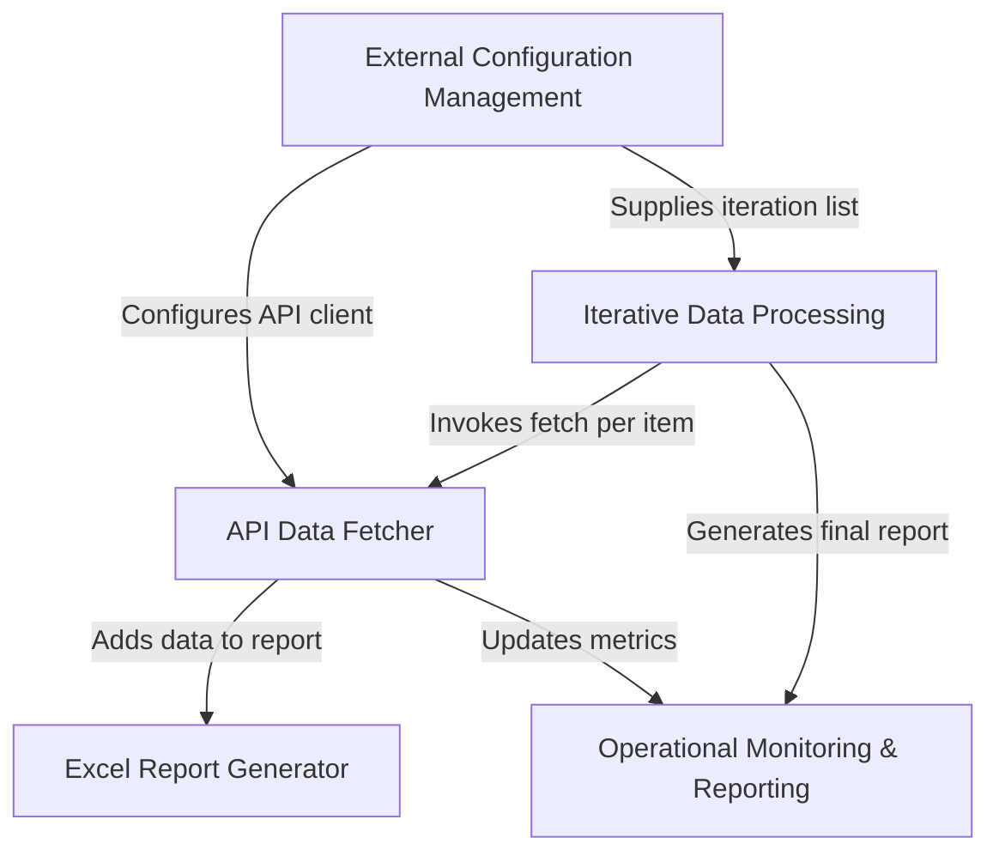

# Tutorial: gooru-api-new

This project is like an automated assistant that helps teachers and administrators track student engagement. It **automatically fetches** *timespent data* for specific classes from the Gooru API and then neatly organizes all this information into an **easy-to-read Excel spreadsheet**, providing a clear overview of how students are spending time on assignments and reporting on the overall process status.

## Visual Overview

## Chapters

1. [External Configuration Management
](Chapter 1: External Configuration Management.md)
2. [Iterative Data Processing
](02_iterative_data_processing_.md)
3. [API Data Fetcher
](03_api_data_fetcher_.md)
4. [Excel Report Generator
](04_excel_report_generator_.md)
5. [Operational Monitoring & Reporting
](05_operational_monitoring___reporting_.md)

---

Generated by [AI Codebase Knowledge Builder](https://github.com/The-Pocket/Tutorial-Codebase-Knowledge).
