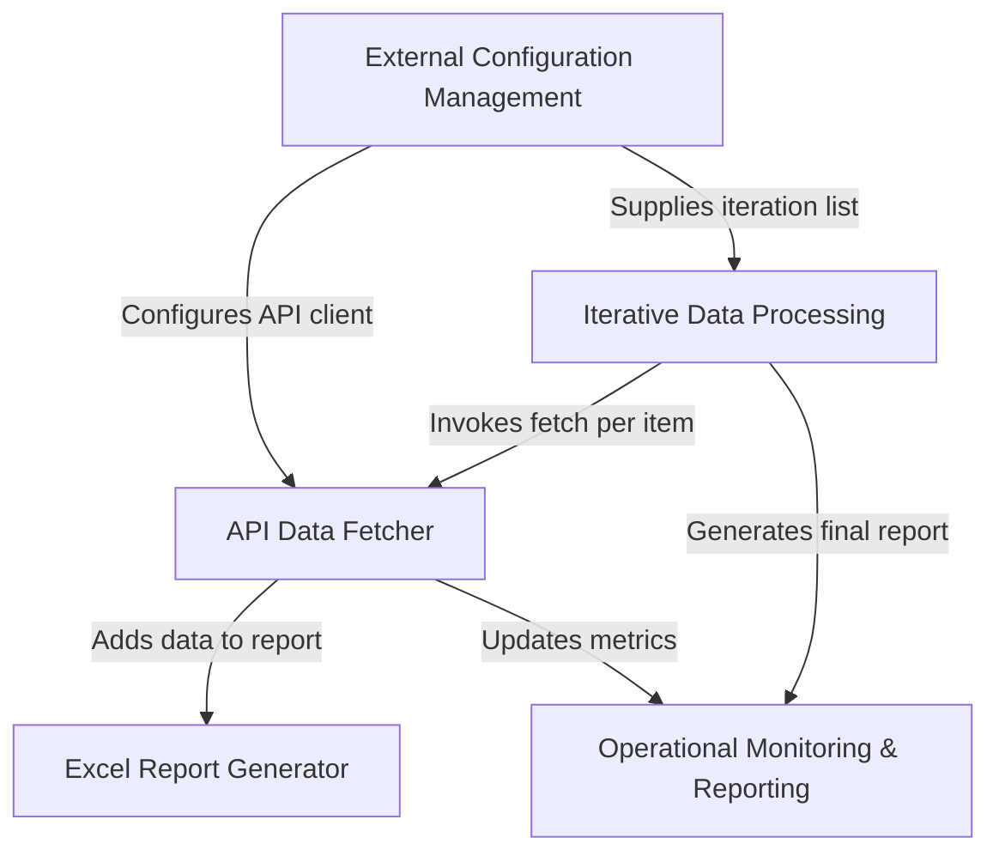

# Tutorial: gooru-api-new

This project is like an automated assistant that helps teachers and administrators track student engagement. It **automatically fetches** *timespent data* for specific classes from the Gooru API and then neatly organizes all this information into an **easy-to-read Excel spreadsheet**, providing a clear overview of how students are spending time on assignments and reporting on the overall process status.

## Visual Overview

## Chapters

1. [External Configuration Management
](https://github.com/iamazadak/gooru-api-new/blob/1df4eb1809fbea302d45dfcfaee350416491d754/Chapter%201%3A%20External%20Configuration%20Management.md)
3. [Iterative Data Processing
](https://github.com/sunder122/gooru-api-new/blob/0691fab11773da62524a73234241064279f5ed5e/Chapter%202%3A%20Iterative%20Data%20Processing%2Cmd)
4. [API Data Fetcher
](03_api_data_fetcher_.md)
5. [Excel Report Generator
](04_excel_report_generator_.md)
6. [Operational Monitoring & Reporting
](05_operational_monitoring___reporting_.md)

---

Generated by [AI Codebase Knowledge Builder](https://github.com/The-Pocket/Tutorial-Codebase-Knowledge).
